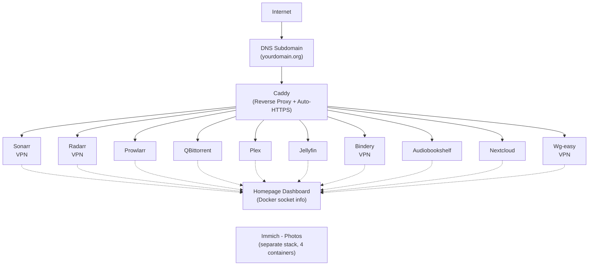

# MetaServ Home Server

A self-hosted media server and homelab demonstrating Docker orchestration, VPN networking, reverse proxy configuration, and automated media management. **23 containers** orchestrated via Docker Compose.


## Architecture Overview



---

## Quick Start (Theoretical Setup)

### Prerequisites

- Ubuntu-based Linux host (tested on recent LTS)
- Docker + Docker Compose v2
- VPN provider supporting WireGuard/OpenVPN
- A domain or subdomain pointing to your server's public IP

### 1. Clone the repository

```bash
git clone https://github.com/<your-username>/home-server-portfolio.git
cd home-server-portfolio/MetaServ
```

### 2. Configure your environment

Create and edit `.env` with your actual values:

```env
# --- User/Group IDs ---
PUID=<your-user-id>
PGID=<your-group-id>
TZ=<your-timezone>

# --- VPN Provider ---
YOUR_VPN_USER=<your-vpn-username>
YOUR_VPN_PASSWORD=<your-vpn-password>

# --- WireGuard VPN Password ---
WG_PASSWORD=<a-strong-password>

# --- Domain Configuration ---
DOMAIN=yourdomain.org
```

### 3. Set up a DNS subdomain

1. Create a subdomain
2. Update `DOMAIN` in `.env` to match your subdomain
3. Ensure DNS A record points to your server's public IP
4. For the `wg-easy` container, set `WG_HOST` to your domain

### 5. Start the stack

```bash
cd MetaServ
docker compose up -d
```

Services start in dependency order — the VPN gateway comes up first, followed by the automation stack, then media servers, and finally the dashboard and reverse proxy.

### 6. Access services

All services are reachable via subdomains (requires proper DNS):

| Service            | URL                                    |
| ------------------ | -------------------------------------- |
| **Dashboard**      | `http://home.yourdomain.org:3000`      |
| **Sonarr**         | `http://sonarr.yourdomain.org`         |
| **Radarr**         | `http://radarr.yourdomain.org`         |
| **Prowlarr**       | `http://prowlarr.yourdomain.org`       |
| **qBittorrent**    | `http://qbittorrent.yourdomain.org`    |
| **Plex**           | `http://plex.yourdomain.org`           |
| **Jellyfin**       | `http://jellyfin.yourdomain.org`       |
| **Nextcloud**      | `http://nextcloud.yourdomain.org`      |
| **Audiobookshelf** | `http://audiobookshelf.yourdomain.org` |
| **Bindery**        | `http://bindery.yourdomain.org`        |
| **Immich**         | `http://immich.yourdomain.org`         |

---

## Services Overview

| Service            | Role                                   | Network | Port                               |
| ------------------ | -------------------------------------- | ------- | ---------------------------------- |
| **Gluetun**        | VPN gateway (WireGuard → VPN provider) | bridge  | 8080, 8989, 7878, 9696, 8000, 8191 |
| **qBittorrent**    | Torrent download client                | VPN     | 8080                               |
| **Sonarr**         | TV series automation                   | VPN     | 8989                               |
| **Radarr**         | Movie automation                       | VPN     | 7878                               |
| **Prowlarr**       | Indexer manager                        | VPN     | 9696                               |
| **Flaresolverr**   | Cloudflare challenge solver            | VPN     | internal                           |
| **Bindery**        | Audiobook automation                   | VPN     | 5050                               |
| **Audiobookshelf** | Audiobook/podcast server               | bridge  | 13378                              |
| **Plex**           | Media streaming                        | host    | 32400                              |
| **Jellyfin**       | Open-source media server               | host    | 8096                               |
| **Threadfin**      | IPTV proxy                             | bridge  | 34400-34401                        |
| **Nextcloud**      | Cloud storage & sync                   | bridge  | 8089                               |
| **Homepage**       | Dashboard / status board               | bridge  | 3000                               |
| **Caddy**          | Reverse proxy + HTTPS                  | host    | 80, 443                            |
| **wg-easy**        | WireGuard VPN server                   | bridge  | 51820/udp, 51821/tcp               |
| **Immich**         | Photo management (4 containers)        | immich  | 2283                               |

---

## Network Topology

Three Docker networks plus host-mode services:

| Network          | Subnet         | Members                                                                                                                            |
| ---------------- | -------------- | ---------------------------------------------------------------------------------------------------------------------------------- |
| `home_default`   | `SUBNET_IP/16` | vpn-gateway, qbittorrent, sonarr, radarr, prowlarr, flaresolverr, audiobookshelf, bindery, nextcloud, threadfin, homepage, wg-easy |
| `immich_default` | `SUBNET_IP/16` | immich_server, immich_postgres, immich_redis, immich_machine_learning                                                              |
| `host`           | Host IP        | plex, jellyfin, caddy                                                                                                              |

**Network modes explained:**

- `network_mode: host` — Services bind directly to the host's network interfaces (required for Caddy to handle ports 80/443)
- `network_mode: service:vpn-gateway` — Services share the gluetun container's network namespace; all internet-bound traffic routes through the VPN tunnel

---

## Data Flow

### TV/Movie Download Pipeline

1. **Sonarr/Radarr** queries **Prowlarr** for available releases
2. **Prowlarr** searches indexers (using **Flaresolverr** to solve Cloudflare challenges when encountered)
3. User selects a release → **Sonarr/Radarr** sends the download to **qBittorrent**
4. **qBittorrent** downloads to `/mnt/media/Downloads`
5. **Sonarr/Radarr** monitors the download folder, imports completed files, and organizes them into `/mnt/media/media/tv` or `/mnt/media/media/movies`
6. **Plex** / **Jellyfin** detect new files via library scanning and make them available for streaming

### Audiobook Pipeline

1. **Bindery** searches **Prowlarr** for audiobook releases
2. Sends torrent to **qBittorrent** → downloads to `/mnt/media/Downloads`
3. **Bindery** processes the download and places completed audiobooks into `/mnt/media/media/audiobooks`
4. **Audiobookshelf** detects the new audiobook and serves it to clients

### Remote Access

- **External users** → `*.yourdomain.org` → **Caddy** (auto-HTTPS) → internal services
- **WireGuard clients** → `yourdomain.org:51820/udp` → **wg-easy** → LAN services
- **VPN-routed services** (qBittorrent, Sonarr, Radarr, Prowlarr, Bindery) are only reachable via the VPN gateway's published ports or through the WireGuard tunnel

---

## Storage Layout

A large drive mounted at `/mnt/media` holds all media and application data:

```
/mnt/media/
├── Downloads/            # Incoming torrent downloads
├── media/
│   ├── movies/           # Organized movie library
│   ├── tv/               # Organized TV library
│   └── audiobooks/       # Organized audiobook library
├── Books/                # E-books (Bindery source)
├── Photos/               # Externally sourced photos (Immich)
├── audiobookshelf_media/ # Audiobookshelf media store
├── jellyfin_media/       # Jellyfin store
├── plex_media/           # Plex store
├── nextcloud_data/       # Nextcloud file storage
└── ...
```

Application configs live under `/home/<service>/config/`.

---

## VPN Configuration

The \*arr automation stack routes through a WireGuard tunnel to a commercial VPN provider (PIA).

- **Container**: `vpn-gateway` (image: `qmcgaw/gluetun`)
- **Protocol**: OpenVPN via PIA
- **Port forwarding**: Enabled for improved torrent performance
- **Firewall rules**: `FIREWALL_OUTBOUND_SUBNETS` allows LAN access while VPN is active
- **WireGuard**: Separate `wg-easy` container for client VPN connections
- **Flaresolverr**: Integrated to solve Cloudflare anti-bot challenges on certain indexers

---

## Reverse Proxy (Caddy)

Caddy provides automatic HTTPS via Let's Encrypt and routes subdomains to internal services. Configured in `Caddyfile`:

```
<service>.yourdomain.org  →  SERVER_IP:<service-port>
```

Includes a landing page for the root domain and automatic certificate management.

---

## Dashboard (Homepage)

The [Homepage](https://github.com/gethomepage/homepage) project provides a unified dashboard showing:

- Service status widgets (Sonarr, Radarr, qBittorrent, Plex, Jellyfin, etc.)
- Docker container health
- System resource monitoring (via `/var/run/docker.sock:ro`)
- Quick-access bookmarks to all services

> **Note**: The `services.yaml` config contains API keys and should never be committed to version control.

---

## Photo Management (Immich — Separate Stack)

Immich runs as a separate Docker Compose project in `/home/immich-app/`:

```bash
cd /home/immich-app
docker compose up -d
```

This starts 4 containers: `immich_server`, `immich_postgres`, `immich_redis`, `immich_machine_learning`.

---

## Port Summary

| Port        | Service        | Mode           |
| ----------- | -------------- | -------------- |
| 3000        | Homepage       | bridge         |
| 5050        | Bindery        | bridge         |
| 8080        | qBittorrent    | VPN gateway    |
| 8089        | Nextcloud      | bridge         |
| 8989        | Sonarr         | VPN gateway    |
| 9696        | Prowlarr       | VPN gateway    |
| 7878        | Radarr         | VPN gateway    |
| 13378       | Audiobookshelf | bridge         |
| 34400-34401 | Threadfin      | bridge         |
| 51820/udp   | wg-easy VPN    | bridge         |
| 51821/tcp   | wg-easy Web UI | bridge         |
| 2283        | Immich         | immich_default |
| 32400       | Plex           | host           |
| 80/443      | Caddy          | host           |

---

## Security Notes

- All torrent automation services are VPN-routed (no direct internet exposure)
- Caddy handles TLS termination with auto-renewing Let's Encrypt certificates
- WireGuard provides encrypted remote access
- Plex media volumes are mounted read-only where possible
- `.env` and `services.yaml` (with API keys) are excluded from version control

---

## Files in This Repository

```
.
├── MetaServ/                  # Portfolio-ready configuration files
│   ├── docker-compose.yml     # Main stack definition (19 containers)
│   ├── Caddyfile              # Reverse proxy configuration (uses SERVER_IP placeholders)
│   ├── configs/
│   │   └── gluetun/auth/config.toml   # VPN port-forward auth rule
│   ├── homepage/
│   │   ├── config/            # Dashboard widgets, bookmarks, layouts
│   │     ├── settings.yaml
│   │     ├── widgets.yaml
│   │     ├── bookmarks.yaml
│   │     ├── docker.yaml
│   │     ├── proxmox.yaml   # (commented out)
│   │     ├── kubernetes.yaml
│   │     └── custom.js/css
│   └── caddy/                 # Caddy runtime 
└── README.md                  # This file
```

> **Excluded from this repo**: `.env` (real credentials), `services.yaml` (API keys), all media/data directories, application database files, TLS certificates, `archive/` (old config backups), and all log files.

---

## Technologies Used

- **Docker & Docker Compose** — Container orchestration
- **Caddy** — Automatic HTTPS reverse proxy
- **Gluetun** — VPN gateway (WireGuard/OpenVPN)
- **Sonarr / Radarr / Prowlarr / qBittorrent** — Media automation
- **Plex / Jellyfin / Audiobookshelf** — Media streaming
- **Nextcloud** — Self-hosted cloud storage
- **Homepage** — Dashboard & monitoring
- **wg-easy** — WireGuard VPN server
- **Immich** — Photo management
- **Bindery** — Audiobook automation
- **Flaresolverr** — Cloudflare challenge solver
